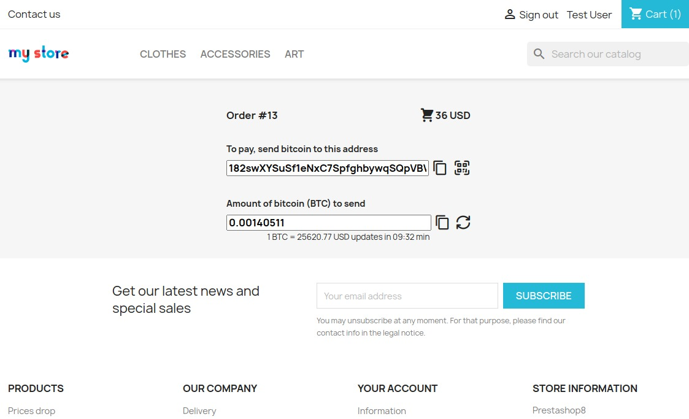
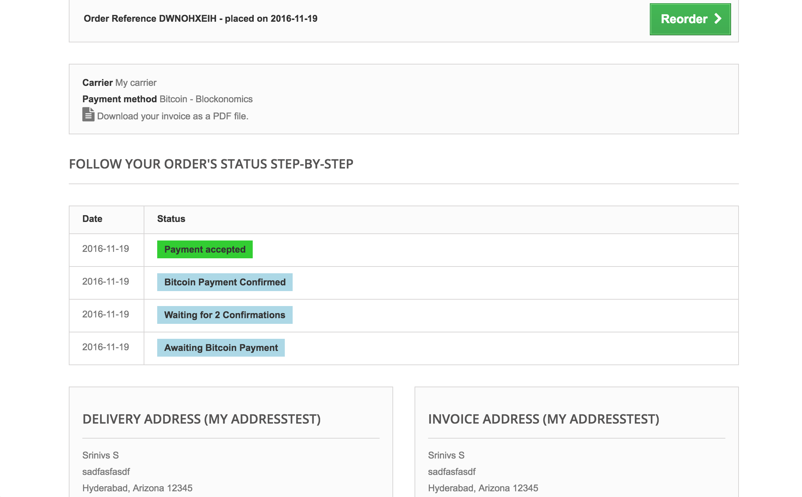
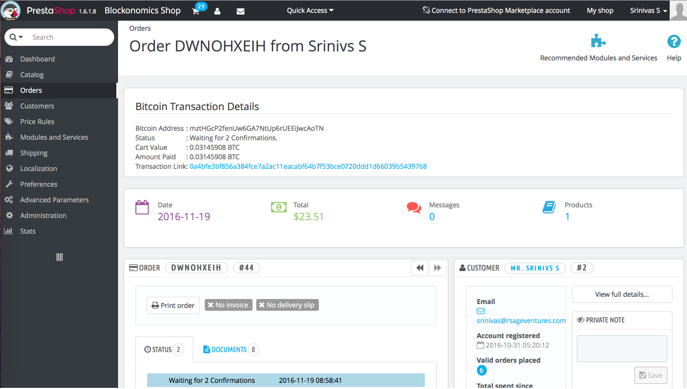

Features
--------
- Accept bitcoin and bitcoin cash payments on your website with ease
- Payments go directly in your own bitcoin wallet
- All HD wallet like trezor, blockchain.info, mycelium supported
- No approvals of API key/documentation required

Installation
-----------------
- [Installation Video Tutorial](https://www.youtube.com/watch?v=zgbgVOcjw0c)
- Upload blockonomics.zip from [releases](https://github.com/blockonomics/prestashop-plugin/releases) using Modules and Services > Add new Module.
- Locate the module in Admin > modules list (search author blockonomics) and click on Install
- Add store on  [blockonomics merchant page](https://www.blockonomics.co/merchants) 
- Put shown API key in prestashop module and *Save* settings
- Click on *Test Setup* to make sure everything is working 

Languages
-------------
- Currently available in English, French, German, Spanish, Czech, Italian and
  Polish
- Contribution for other lanugages are welcome. Feel free to send us files from your backoffice or create a pull request

Screenshots
-----------------
#### Checkout Page 

#### Order Details 

#### Admin Orders Page 

